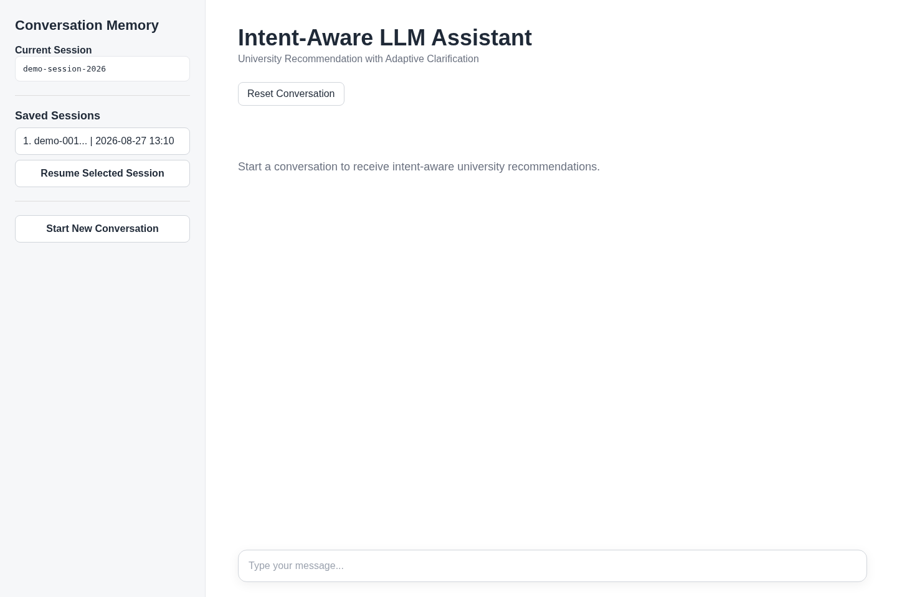
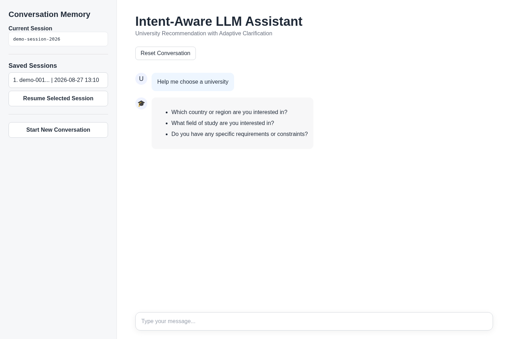
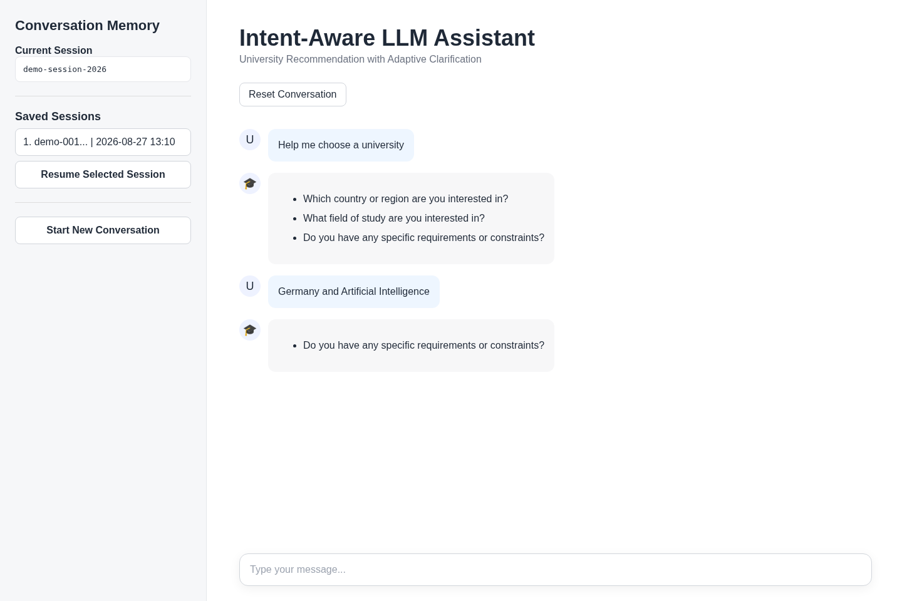
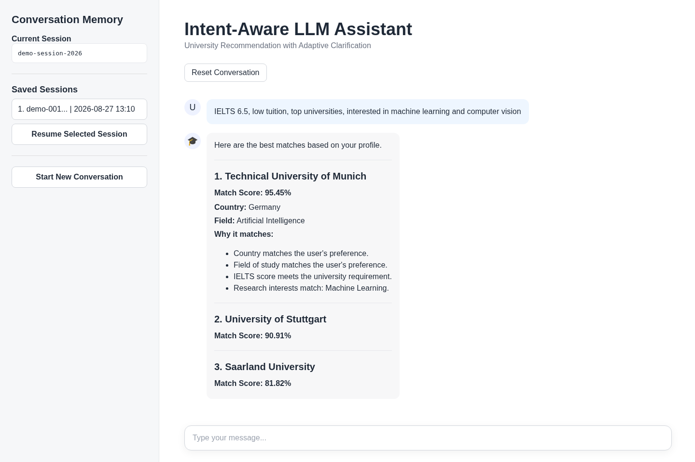
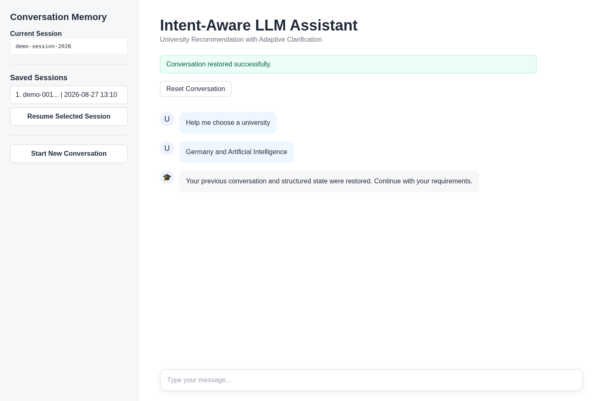

# Intent-Aware LLM Assistant

An intent-aware, clarification-driven LLM assistant for reliable multi-turn university recommendation.

The system detects user intent, extracts structured information, identifies missing information, asks targeted clarification questions, maintains short-term conversational state, models user preferences, ranks universities, and preserves conversation history through persistent memory.

The project is designed as:

* a functional AI application
* a bachelor-level research and portfolio project
* a foundation for future research on reliable and adaptive LLM assistants

---

# Research Motivation

Large Language Models often answer immediately even when a user's request is incomplete, ambiguous, or underspecified.

This project investigates a different interaction policy:

> Before answering, an assistant should determine whether it has enough information to respond reliably.

If important information is missing, the assistant asks only the necessary clarification questions.

The central research question is:

> Does explicit intent detection, structured state tracking, and adaptive clarification improve multi-turn reliability compared with direct-answer behavior?

---

# Current Use Case

The current implementation focuses on university recommendation.

The assistant collects and reasons over information such as:

* country
* field of study
* IELTS score
* tuition preference
* ranking preference
* research interests
* additional academic requirements

Example:

```text
User:
Help me choose a university
```

The assistant identifies that important information is missing and asks targeted clarification questions.

```text
Assistant:
Which country or region are you interested in?
What field of study are you interested in?
Do you have any specific requirements or constraints?
```

The user may answer incrementally:

```text
User:
Germany and Artificial Intelligence
```

The system preserves the information already provided and asks only for the remaining requirements.

```text
User:
IELTS 6.5, low tuition, top universities,
interested in machine learning and computer vision
```

The assistant then builds a structured user profile and ranks matching universities.

---

# Demo

## Home Interface



## Adaptive Clarification



## Multi-Turn State Tracking



## Personalized Recommendations



## Persistent Memory and Session Resume



---

# System Architecture

```text
User Input
    |
    v
Intent Detection + Structured Extraction
    |
    v
Normalization
    |
    v
State Manager
    |
    v
Missing Information Detection
    |
    +-------------------------------+
    |                               |
    v                               v
Adaptive Clarification        User Profile Builder
    |                               |
    v                               v
Next User Turn                 Ranking Engine
                                    |
                                    v
                              University Search
                                    |
                                    v
                              Answer Generation
                                    |
                                    v
                           Persistent Memory
```

The architecture deliberately separates short-term state from persistent memory.

```text
StateManager
    -> structured state for the current conversation

ConversationMemory
    -> persistent SQLite conversation history
```

Raw conversation history is not blindly injected into the ranking or reasoning pipeline.

When a stored session is resumed, the latest valid structured state is reconstructed from stored assistant output.

---

# Core Components

## 1. LLM Interface

File:

```text
src/llm.py
```

The project currently uses a locally hosted:

```text
Llama 3.1 8B
```

through Ollama.

The LLM layer provides controlled access for tasks such as:

* intent detection
* structured information extraction
* answer generation
* summarization

Structured extraction is isolated from ranking and state logic.

---

## 2. Intent Detection

File:

```text
src/intent.py
```

The system detects whether the user's request belongs to the supported recommendation workflow and extracts the relevant structured fields.

Canonical intent:

```text
recommendation
```

---

## 3. State Management

File:

```text
src/state_manager.py
```

`StateManager` maintains short-term structured conversation state.

Example:

```json
{
  "intent": "recommendation",
  "collected_information": {
    "country": "Germany",
    "field": "Artificial Intelligence",
    "requirements": "IELTS 6.5, low tuition, top universities"
  },
  "missing_information": []
}
```

The state is updated across turns so that previously supplied information does not need to be requested again.

---

## 4. Adaptive Clarification

Files:

```text
src/clarification.py
src/question_generator.py
src/question_ranker.py
```

Clarification is triggered only when required information is still missing.

The clarification workflow provides:

* deterministic missing-field handling
* stable question ordering
* no unnecessary duplicate questions
* no clarification after sufficient information has been collected

Current clarification priority:

```text
1. country
2. field
3. requirements
```

---

## 5. User Profile Modeling

File:

```text
src/user_profile.py
```

The system transforms collected conversation information into a structured user profile.

Example:

```json
{
  "country": "Germany",
  "field": "Artificial Intelligence",
  "ielts": 6.5,
  "tuition_preference": "low tuition",
  "ranking_preference": "top",
  "research_interests": [
    "Machine Learning",
    "Computer Vision"
  ]
}
```

Research-interest extraction supports areas such as:

* Machine Learning
* Computer Vision
* Natural Language Processing
* Robotics
* Deep Learning

---

## 6. Personalized Ranking Engine

File:

```text
src/ranking_engine.py
```

Universities are ranked using explicit weighted criteria.

Current canonical weighting:

```text
Country match        20
Field match          25
IELTS compatibility  20
Tuition preference   15
Ranking preference   20
```

Research-interest alignment is also integrated as a proportional matching signal.

The ranking engine returns:

```text
match_score
reasons
score_breakdown
```

Canonical Ranking V2 regression:

```text
Technical University of Munich    95.45
University of Stuttgart           90.91
Saarland University               81.82
```

---

## 7. University Search

File:

```text
src/university_search.py
```

The current university knowledge base is stored in:

```text
data/universities.json
```

The dataset is intentionally small and controlled because the current focus of the project is conversational reliability rather than large-scale university retrieval.

---

## 8. Answer Generation

File:

```text
src/answer_generator.py
```

Final responses are generated separately from the structured extraction pipeline.

This separation helps prevent the answer-generation layer from interfering with state tracking and evaluation logic.

---

## 9. Persistent Conversation Memory

File:

```text
src/memory.py
```

Persistent memory uses SQLite.

Local database:

```text
memory.db
```

The memory system supports:

* automatic session creation
* message persistence
* session listing
* reopening previous sessions
* retrieving conversation history
* structured-state restoration

Important architecture:

```text
StateManager
= current short-term structured state

ConversationMemory
= persistent session and message history
```

These components are intentionally kept separate.

`memory.db` is excluded from the Git repository because it contains local conversation data.

---

# Command-Line Interface

Run:

```bash
python -m src.main
```

Supported commands include:

```text
sessions
resume <session_id>
stop
exit
```

Example:

```text
resume e0510ec1-4227-418b-b068-381308804dd1
```

Do not include angle brackets around the actual session ID.

---

# Streamlit Interface

Run:

```bash
streamlit run app.py
```

The Streamlit application supports:

* multi-turn chat
* adaptive clarification
* university recommendations
* ranking explanations
* current session display
* saved session listing
* resume previous session
* start new conversation
* restored chat history
* restored structured state

---

# Research Evaluation

The project includes a dedicated research evaluation layer under:

```text
evaluation/
```

The evaluation framework covers:

* single-turn intent and extraction
* multi-turn clarification
* direct-answer baseline comparison
* robustness testing
* state ablation
* clarification ablation
* final result aggregation

---

# 1. Single-Turn Evaluation

Run:

```bash
python evaluation/evaluate.py
```

Canonical results:

| Metric                          |  Result |
| ------------------------------- | ------: |
| Dataset Samples                 |      15 |
| Successfully Evaluated          |      15 |
| Failed Samples                  |       0 |
| Intent Accuracy                 | 100.00% |
| Missing Information Precision   |  91.30% |
| Missing Information Recall      | 100.00% |
| Missing Information F1          |  95.45% |
| Missing Information Exact Match |  86.67% |

---

# 2. Multi-Turn Evaluation

Run:

```bash
python evaluation/evaluate_multiturn.py
```

Canonical results:

| Metric                          |  Result |
| ------------------------------- | ------: |
| Total Conversations             |       4 |
| Total Turns                     |      10 |
| Missing Information Accuracy    | 100.00% |
| Clarification Decision Accuracy | 100.00% |
| Complete Conversation Accuracy  | 100.00% |

---

# Direct-Answer Baseline

The project includes an independent direct-answer baseline:

```text
evaluation/evaluate_baseline.py
```

The baseline:

* does not use adaptive clarification
* does not use short-term conversation state
* does not use persistent memory
* does not perform state restoration
* always attempts to answer directly

Run:

```bash
python evaluation/evaluate_baseline.py
```

Canonical baseline results:

| Metric                               |  Result |
| ------------------------------------ | ------: |
| Intent Accuracy                      | 100.00% |
| Missing Information Precision        |  91.30% |
| Missing Information Recall           | 100.00% |
| Missing Information F1               |  95.45% |
| Missing Information Exact Match      |  86.67% |
| Direct Answer Rate                   | 100.00% |
| Incomplete-Prompt Direct Answer Rate | 100.00% |
| Clarification Attempt Rate           |   0.00% |

The baseline intentionally retains the ability to detect missing information.

The difference is behavioral:

> The baseline may know that information is missing, but it does not act on that knowledge through clarification.

---

# Comparative Evaluation

Run:

```bash
python evaluation/evaluate_comparison.py
```

Results:

| Metric                           | Adaptive System | Direct Baseline | Difference |
| -------------------------------- | --------------: | --------------: | ---------: |
| Missing Information Accuracy     |         100.00% |          50.00% |  +50.00 pp |
| Clarification Decision Accuracy  |         100.00% |          40.00% |  +60.00 pp |
| Complete Conversation Accuracy   |         100.00% |          25.00% |  +75.00 pp |
| Continuation-Turn State Accuracy |         100.00% |          16.67% |  +83.33 pp |
| Premature Direct-Answer Rate ↓   |           0.00% |         100.00% |          — |
| Complete-Input Handling Accuracy |         100.00% |         100.00% |          — |

The strongest difference appears on continuation turns.

The adaptive assistant retains previously supplied information, while the direct baseline evaluates each prompt independently.

---

# Robustness Evaluation

Run:

```bash
python evaluation/evaluate_robustness.py
```

The robustness suite evaluates:

* paraphrased requests
* informal language
* typographical errors
* irrelevant surrounding context
* reordered information
* fragmented information
* complete dense requests
* research-interest disambiguation
* short fragments
* natural long-form requests

Canonical results:

| Metric                           | Result |
| -------------------------------- | -----: |
| Total Conversations              |     10 |
| Total Turns                      |     26 |
| Continuation Turns               |     16 |
| Failed Turns                     |      0 |
| Missing Information Accuracy     | 96.15% |
| Clarification Decision Accuracy  | 96.15% |
| Complete Conversation Accuracy   | 90.00% |
| Continuation-Turn State Accuracy | 93.75% |

Most robustness categories achieved 100%.

The main observed weakness was long-form natural input:

```text
Missing Accuracy:        50.00%
Clarification Accuracy:  50.00%
```

This is treated as an observed limitation rather than being hidden or optimized away.

---

# Ablation Study

Ablation testing is used to isolate the contribution of individual architectural components.

---

## No-State Ablation

Run:

```bash
python evaluation/evaluate_ablation_state.py
```

In this condition, state is intentionally reset before every turn.

Results:

| Metric                             | Full System | No-State |    Change |
| ---------------------------------- | ----------: | -------: | --------: |
| Missing Information Accuracy       |     100.00% |   50.00% | -50.00 pp |
| Clarification Decision Accuracy    |     100.00% |   70.00% | -30.00 pp |
| Complete Conversation Accuracy     |     100.00% |   25.00% | -75.00 pp |
| Continuation-Turn Missing Accuracy |     100.00% |   16.67% | -83.33 pp |

First-turn performance remained at 100%.

This indicates that state tracking primarily contributes to preserving information across continuation turns.

---

## No-Clarification Ablation

Run:

```bash
python evaluation/evaluate_ablation_clarification.py
```

In this condition:

```text
State tracking          ON
Adaptive clarification  OFF
```

Results:

| Metric                           | Full System | No-Clarification |     Change |
| -------------------------------- | ----------: | ---------------: | ---------: |
| Missing Information Accuracy     |     100.00% |          100.00% |    0.00 pp |
| Clarification Decision Accuracy  |     100.00% |           40.00% |  -60.00 pp |
| Complete Conversation Accuracy   |     100.00% |           25.00% |  -75.00 pp |
| Premature Direct-Answer Rate     |       0.00% |          100.00% | +100.00 pp |
| Complete-Input Handling Accuracy |     100.00% |          100.00% |    0.00 pp |
| Continuation-Turn State Accuracy |     100.00% |          100.00% |    0.00 pp |

This experiment demonstrates that:

> Detecting missing information is not equivalent to taking the correct conversational action.

The system may correctly recognize an incomplete request while still behaving unreliably if adaptive clarification is removed.

---

# Final Research Results

Canonical Stage 8 results are collected by:

```bash
python evaluation/final_results.py
```

This generates:

```text
evaluation/results/final_metrics.json
evaluation/results/research_results.md
```

The JSON file provides a machine-readable record of the canonical results.

The Markdown file contains research-ready result tables and interpretation.

---

# Main Research Findings

## 1. State tracking matters primarily in multi-turn interaction

Removing state reduced continuation-turn missing-information accuracy:

```text
100.00% -> 16.67%
```

while first-turn performance remained unchanged.

---

## 2. Adaptive clarification is behaviorally distinct from extraction

Removing clarification did not reduce structured missing-information accuracy:

```text
100.00% -> 100.00%
```

but clarification decision accuracy fell:

```text
100.00% -> 40.00%
```

and premature direct-answer behavior increased:

```text
0.00% -> 100.00%
```

---

## 3. The adaptive system performs better than direct-answer behavior on incomplete requests

The direct baseline handled complete prompts correctly but performed poorly when requests required additional information.

The largest observed comparison difference was:

```text
Continuation-Turn State Accuracy

Adaptive: 100.00%
Baseline: 16.67%
Difference: +83.33 percentage points
```

---

## 4. Robustness is high but not perfect

The system performed reliably across:

* paraphrasing
* informal language
* typos
* fragmented input
* reordered input
* irrelevant surrounding context

Long-form natural requests remain a measurable weakness.

---

# Reproducibility

## Requirements

* Python
* Ollama
* Llama 3.1 8B
* Streamlit

Install dependencies:

```bash
pip install -r requirements.txt
```

Current Python dependencies include:

```text
ollama
streamlit
python-dotenv
```

Install the local model:

```bash
ollama pull llama3.1:8b
```

---

## Run the CLI

```bash
python -m src.main
```

---

## Run Streamlit

```bash
streamlit run app.py
```

---

## Run Core Evaluation

```bash
python evaluation/evaluate.py
python evaluation/evaluate_multiturn.py
```

---

## Run Research Evaluation

```bash
python evaluation/evaluate_baseline.py
python evaluation/evaluate_comparison.py
python evaluation/evaluate_robustness.py
python evaluation/evaluate_ablation_state.py
python evaluation/evaluate_ablation_clarification.py
python evaluation/final_results.py
```

---

## Compile Regression

```bash
python -m compileall src evaluation app.py
```

---

# Final Regression Status

The complete post-evaluation regression suite passed.

```text
Single-turn evaluation        PASS
Multi-turn evaluation         PASS
Compile regression            PASS
CLI persistence regression    PASS
Streamlit persistence test    PASS
```

The core application behavior remained stable after the research evaluation layer was added.

---

# Project Structure

```text
Intent-Aware-LLM-Assistant/
│
├── app.py
├── README.md
├── requirements.txt
├── .env
├── .gitignore
├── memory.db
│
├── data/
│   └── universities.json
│
├── docs/
│   └── images/
│       ├── 01-home.png
│       ├── 02-clarification.png
│       ├── 03-multiturn-state.png
│       ├── 04-recommendations.png
│       └── 05-memory-resume.png
│
├── evaluation/
│   ├── __init__.py
│   ├── dataset.json
│   ├── evaluate.py
│   ├── evaluate_multiturn.py
│   ├── evaluate_baseline.py
│   ├── evaluate_comparison.py
│   ├── evaluate_robustness.py
│   ├── evaluate_ablation_state.py
│   ├── evaluate_ablation_clarification.py
│   ├── final_results.py
│   ├── field_normalizer.py
│   ├── normalizer.py
│   │
│   └── results/
│       ├── final_metrics.json
│       └── research_results.md
│
└── src/
    ├── __init__.py
    ├── answer_generator.py
    ├── clarification.py
    ├── intent.py
    ├── llm.py
    ├── main.py
    ├── memory.py
    ├── memory_manager.py
    ├── question_generator.py
    ├── question_ranker.py
    ├── ranking_engine.py
    ├── state_manager.py
    ├── university_search.py
    └── user_profile.py
```

Note:

```text
.env
memory.db
venv/
__pycache__/
```

are intentionally excluded from the public Git repository.

---

# Current Limitations

The current implementation still has several limitations.

* The university dataset is small and manually controlled.
* The system currently focuses on one primary recommendation domain.
* Evaluation datasets are relatively small.
* Robustness decreases for some long-form natural requests.
* Ranking weights are manually defined rather than learned.
* Research-interest extraction uses a limited controlled vocabulary.
* The system does not yet use external real-time university information.
* No retrieval-augmented generation pipeline is currently integrated.
* Long-term preference learning across many sessions is not yet implemented.
* The current evaluation does not include human preference judgments.
* Latency and computational cost have not yet been formally benchmarked.

The reported metrics should therefore be interpreted as controlled experimental results for the current prototype rather than universal performance estimates.

---

# Future Work

## Uncertainty-Aware Clarification

Instead of using only missing-field detection, the assistant could estimate uncertainty and ask clarification when extracted information is ambiguous or low-confidence.

---

## Learned Clarification Policy

The current clarification behavior is deterministic.

Future work could learn when and what to ask using:

* reinforcement learning
* preference optimization
* supervised dialogue data

---

## Adaptive Ranking Weights

Current ranking weights are manually defined.

Future systems could learn personalized weighting from:

* explicit user feedback
* interaction history
* accepted recommendations
* long-term preference behavior

---

## Long-Term User Modeling

Persistent memory could be extended from session restoration into durable preference modeling across multiple conversations.

Examples:

* preferred countries
* budget sensitivity
* research interests
* ranking priorities
* academic goals

---

## Retrieval and External Knowledge

Future versions could integrate:

* university APIs
* official admissions pages
* retrieval-augmented generation
* live tuition and admission requirements
* deadline retrieval

---

## Larger-Scale Evaluation

Future research should use:

* larger datasets
* more domains
* adversarial ambiguity
* human evaluators
* multiple LLM backends
* statistical significance testing

---

# Research Extension

The current project can serve as a foundation for broader research on:

* intent-aware conversational systems
* adaptive clarification
* LLM decision reliability
* multi-turn state reasoning
* persistent conversational memory
* personalized recommendation
* uncertainty-aware interaction
* long-term user preference modeling

A possible future research question is:

> How can an intelligent assistant learn when clarification is worth the additional interaction cost?

This extends the current deterministic clarification architecture toward adaptive decision-making.

---

# Portfolio Summary

**Intent-Aware LLM Assistant**

Designed and implemented a multi-turn LLM-based university recommendation assistant with structured intent detection, adaptive clarification, conversation state tracking, personalized ranking, user-profile modeling, and SQLite-based persistent memory.

Built a research evaluation framework including a direct-answer baseline, robustness testing, and component ablation studies.

Key experimental findings include:

* 100% clarification-decision accuracy on the canonical multi-turn evaluation
* +83.33 percentage-point improvement in continuation-turn state accuracy over the direct-answer baseline
* state ablation reduced continuation-turn accuracy from 100% to 16.67%
* removing adaptive clarification increased premature direct answers from 0% to 100%
* 96.15% missing-information and clarification accuracy under robustness testing

---

# Status

```text
Stage 1 — Project Structure                         COMPLETE
Stage 2 — Intent Detection + Extraction             COMPLETE
Stage 3 — Adaptive Clarification + State            COMPLETE
Stage 4 — Cleanup + Regression                      COMPLETE
Stage 5 — Personalized Ranking                      COMPLETE
Stage 6 — User Profile Modeling                     COMPLETE
Stage 7 — Persistent Memory                         COMPLETE
Stage 8 — Research Evaluation                       COMPLETE
Stage 9 — Finalization                               PROGRESS
COMPLETE
